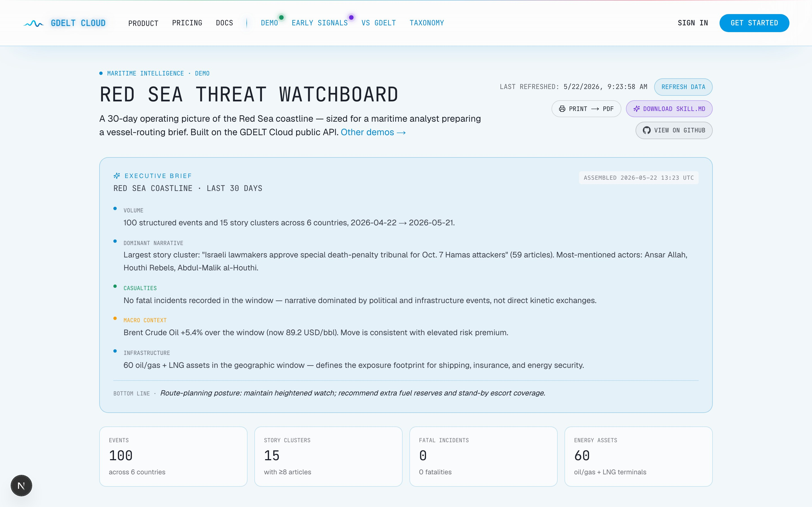
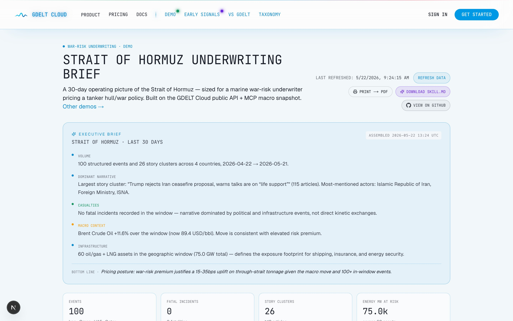
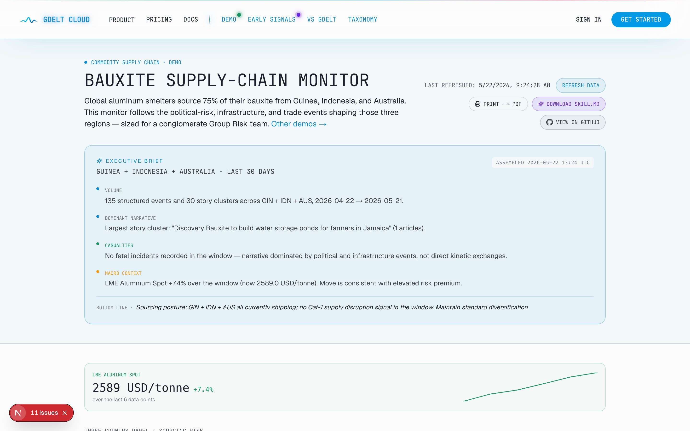

# 🌐 GDELT Cloud — Workflow Demos

> Three customer-shaped workflow dashboards built **only on the GDELT Cloud public REST API**. Each demo is a self-contained Python project — pulls structured events, story clusters, named entities, and (where relevant) energy infrastructure exposure for a specific operating picture, then renders a **single static HTML report** you can open in a browser, share as a link, or print to PDF.

| 🛰️ Demo | 👤 Persona | 🗺️ Region |
|---|---|---|
| [`red-sea-watchboard/`](./red-sea-watchboard) | Maritime intelligence analyst | Red Sea coastline / Bab-el-Mandeb |
| [`strait-of-hormuz-underwriting-brief/`](./strait-of-hormuz-underwriting-brief) | War-risk underwriter | Strait of Hormuz / Persian Gulf |
| [`bauxite-supply-chain-monitor/`](./bauxite-supply-chain-monitor) | Commodity Group Risk team | Guinea + Indonesia + Australia |

**🌍 Live versions** (refreshed daily):

- [gdeltcloud.com/demos/red-sea-watchboard](https://gdeltcloud.com/demos/red-sea-watchboard)
- [gdeltcloud.com/demos/strait-of-hormuz-underwriting-brief](https://gdeltcloud.com/demos/strait-of-hormuz-underwriting-brief)
- [gdeltcloud.com/demos/bauxite-supply-chain-monitor](https://gdeltcloud.com/demos/bauxite-supply-chain-monitor)

---

## 🚢 Red Sea Threat Watchboard

[](./red-sea-watchboard)

## ⚓ Strait of Hormuz Underwriting Brief

[](./strait-of-hormuz-underwriting-brief)

## 🪨 Bauxite Supply-Chain Monitor

[](./bauxite-supply-chain-monitor)

---

## 🚀 Quick start

```bash
git clone https://github.com/gdelt-cloud/demos.git
cd demos/<demo-name>
cp .env.example .env
# paste your gdelt_sk_* key into GDELT_API_KEY
uv sync
uv run python -m <package>
```

The package name matches the demo folder (`maritime` / `hormuz` / `bauxite`). Each demo's own README has the specifics.

> 🔑 **Get an API key** at [gdeltcloud.com/api-keys](https://gdeltcloud.com/api-keys).

---

## 🧰 What's in each demo

Every demo follows the same skeleton — copy-paste-able:

```
<demo-name>/
├── pyproject.toml          # uv + httpx + jinja2 + pydantic-settings
├── README.md               # 1-page description + run instructions
├── SKILL.md                # 🤖 agent-scaffold instructions
├── .env.example
├── src/<package>/
│   ├── settings.py         # env loading via pydantic-settings
│   ├── client.py           # httpx wrapper for the GDELT Cloud REST API
│   ├── fetch.py            # the 4-6 API calls for this demo
│   ├── render.py           # Jinja2 → single static index.html
│   └── cli.py              # python -m <package> entrypoint
└── templates/
    └── index.html.j2       # Tailwind via CDN + Leaflet via CDN
```

> ✨ No build step, no backend, no API key beyond your GDELT Cloud key.

---

## 🤖 Hand it to your coding agent

> **Each demo ships with a [`SKILL.md`](./red-sea-watchboard/SKILL.md) file.** Hand it to your coding agent — Claude Code, Cursor, Copilot CLI — and ask it to scaffold a variant for your route, your commodity, your persona.

### 💬 Example prompts

```text
Use red-sea-watchboard/SKILL.md to scaffold a Suez Canal disruption watchboard.
```

```text
Use strait-of-hormuz-underwriting-brief/SKILL.md to build a Strait-of-Malacca
war-risk brief for marine hull/war underwriting.
```

```text
Use bauxite-supply-chain-monitor/SKILL.md to monitor cobalt sourcing across
DRC + Indonesia + Australia.
```

The SKILL files describe a **generic pattern** (maritime threat ⛵ · war-risk underwriting 📈 · commodity supply-chain ⛓️) with a menu of regions and entity-anchors, so the agent can adapt the demo without rewriting the skeleton.

### 📥 Or grab the SKILL file from the live demo

Every demo page on [gdeltcloud.com/demos](https://gdeltcloud.com/demos) has a **Download SKILL.md** button — click it, drop the file into your project, point your agent at it.

---

## 🛠️ How the data is sourced

| Endpoint | Used for |
|---|---|
| `GET /api/v2/events` | Structured ACLED + CAMEO+ events — country/bbox/time-window filtered |
| `GET /api/v2/stories` | Article-cluster narratives sized by article_count |
| `GET /api/v2/entities` | Named people / organizations, linked to Wikipedia |
| `GET /api/v2/energy/assets` | Global Energy Monitor infrastructure (oil/gas, LNG, etc.) |
| MCP `macro_finance` | Brent / WTI / LME aluminum spot (optional sidebar) |
| MCP `web_research` | Tavily-sourced article snippets (optional sidebar) |

📚 Full API documentation: [docs.gdeltcloud.com](https://docs.gdeltcloud.com).

---

## 📄 License

MIT. Fork freely. Demo content (titles, copy) is illustrative; the underlying GDELT data is © GDELT Project.
