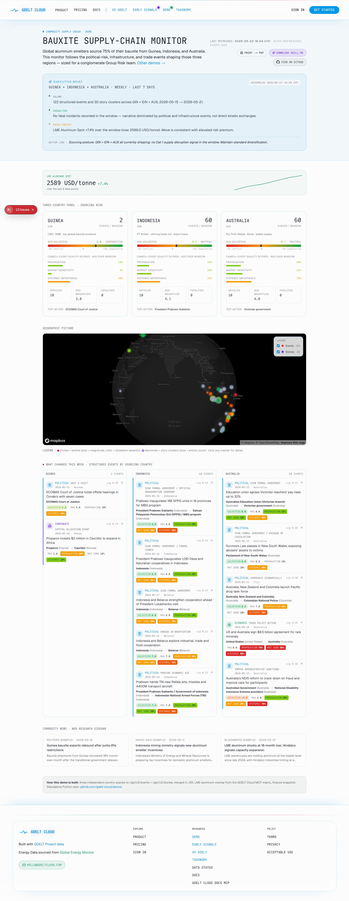

# 🪨 GDELT Cloud Demo — Bauxite Supply-Chain Monitor

> A **commodity supply-chain operating picture** for the global aluminum / bauxite trade — covering Guinea, Indonesia, and Australia, the three primary bauxite-sourcing regions. Built only on the GDELT Cloud public REST API.

🌍 **Live version:** [gdeltcloud.com/demos/bauxite-supply-chain-monitor](https://gdeltcloud.com/demos/bauxite-supply-chain-monitor) · 📦 **Repo:** [github.com/gdelt-cloud/demos](https://github.com/gdelt-cloud/demos/tree/main/bauxite-supply-chain-monitor)



---

## 📊 What it shows

- ✨ **Executive brief** with a commodity / Group-Risk takeaway
- 🌐 A **per-country panel** for each of Guinea, Indonesia, and Australia — event count, average Goldstein severity with cooperative ↔ conflict spectrum bar, and the three CAMEO+ score bars that matter for supply-chain risk: **Propagation potential**, **Market sensitivity**, **Systemic importance**, plus average magnitude, article count, fatalities, and the top actor in window
- 🗺️ A **unified world map** with magnitude-sized + Goldstein-colored event markers across all three regions plus toggleable Events / Stories layers
- 📋 A **"what changed this week"** structured-events feed, **grouped by sourcing country** (Guinea · Indonesia · Australia side by side), de-duped so the same top story doesn't repeat across columns
- 📈 An **LME aluminum spot price sparkline** sourced live from the GDELT Cloud MCP `macro_finance` proxy
- 📰 Story clusters narrating the commodity picture, anchored by `search=aluminum bauxite mining`

Pulls two endpoints, once per country (six calls total):

```
GET /api/v2/events?country=GIN&...
GET /api/v2/events?country=IDN&...
GET /api/v2/events?country=AUS&...
GET /api/v2/stories?country=GIN&search=aluminum+bauxite+mining&...
GET /api/v2/stories?country=IDN&search=aluminum+bauxite+mining&...
GET /api/v2/stories?country=AUS&search=aluminum+bauxite+mining&...
```

> Three independent country queries — merged in Python so the dashboard can show per-country panels **AND** a unified map / table.

---

## 🚀 Run it

### Prerequisites

- 🐍 Python 3.11+
- 📦 [`uv`](https://docs.astral.sh/uv/) installed
- 🔑 A GDELT Cloud API key — get one at [gdeltcloud.com/api-keys](https://gdeltcloud.com/api-keys)

### One-shot

```bash
git clone https://github.com/gdelt-cloud/demos.git
cd demos/bauxite-supply-chain-monitor
cp .env.example .env
# edit .env, paste your gdelt_sk_* key into GDELT_API_KEY
uv sync
uv run python -m bauxite
```

Output:

```
GDELT Cloud Bauxite Supply-Chain Monitor · 2026-04-22 → 2026-05-21
Base URL: https://gdeltcloud.com
Fetched: 135 events · 30 stories across 3 countries
  per-country → Guinea: 15e/10s · Indonesia: 60e/10s · Australia: 60e/10s

✓ Rendered: /path/to/demos/bauxite-supply-chain-monitor/output/index.html
```

📂 Open `output/index.html` in your browser. 🖨️ Print to PDF works out of the box (Cmd/Ctrl+P).

### Custom window

```bash
BAUXITE_DATE_START=2026-03-22 BAUXITE_DATE_END=2026-04-20 uv run python -m bauxite
```

---

## 🤖 Hand it to your coding agent

> **There's a [`SKILL.md`](./SKILL.md) in this repo.** Hand it to your coding agent — Claude Code, Cursor, Copilot CLI — and ask it to scaffold a variant for your commodity, your sourcing regions, or your conglomerate.

### 💬 Example prompts

```text
Use this SKILL.md to monitor cobalt sourcing across DRC + Indonesia + Australia
for the EV battery supply chain.
```

```text
Build a copper supply-chain monitor across Chile + Peru + DRC + Zambia
following the SKILL.md pattern.
```

```text
Adapt this for a coffee supply-chain monitor — Brazil + Vietnam + Colombia,
anchored on Cooxupé + Fyffes + ECOM entities.
```

```text
Use this SKILL.md to build a multi-country lithium-triangle monitor
(Argentina + Bolivia + Chile) for an EV OEM's Group Risk function.
```

---

## 🛠️ Customize it

The demo is intentionally short — ~6 Python files — so you can swap commodity, sourcing regions, or persona.

| 🎯 To change | 📝 Edit |
|---|---|
| Country net (sourcing regions) | `src/bauxite/fetch.py` → `COUNTRIES` |
| Commodity search term | `src/bauxite/fetch.py` → `COMMODITY_SEARCH` |
| Events / stories `limit` | `src/bauxite/fetch.py` → `fetch_all()` |
| Date window default | `src/bauxite/settings.py` → `resolved_window()` |
| Map center + zoom | `templates/index.html.j2` → `L.map().setView(...)` |
| LME aluminum sparkline (live) | `src/bauxite/render.py` → `_LME_ALUMINUM_PLACEHOLDER` (replace with MCP call) |
| Branding / copy | `templates/index.html.j2` |

---

## 🧰 How it works

```
src/bauxite/
  client.py     # httpx wrapper for the GDELT Cloud REST API
  fetch.py      # per-country loop, 2 calls × 3 countries, dataclass merge
  render.py     # Jinja2 -> single index.html with Leaflet map + sparkline
  cli.py        # python -m bauxite entry point
  settings.py   # pydantic-settings for env vars
templates/
  index.html.j2 # Tailwind via CDN + Leaflet via CDN
```

The output is a **single self-contained HTML file**. No backend, no build step.

---

## 📄 License

MIT — fork freely.
