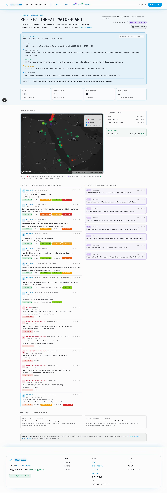

# 🚢 GDELT Cloud Demo — Red Sea Threat Watchboard

> A **maritime intelligence operating picture** of the Red Sea / Bab-el-Mandeb, built only on the GDELT Cloud public REST API. Generates a single static HTML dashboard you can open in a browser or print to PDF.

🌍 **Live version:** [gdeltcloud.com/demos/red-sea-watchboard](https://gdeltcloud.com/demos/red-sea-watchboard) · 📦 **Repo:** [github.com/gdelt-cloud/demos](https://github.com/gdelt-cloud/demos/tree/main/red-sea-watchboard)



---

## 📊 What it shows

- ✨ **Executive brief** auto-generated from the data — paste it straight into a client email
- 📍 Structured **events** along the Red Sea coastline (Yemen, Djibouti, Eritrea, Saudi Arabia, Egypt, Israel) with full CAMEO+ + Conflict subcategory labels and the per-event metric chips (Goldstein severity, magnitude, propagation potential, market sensitivity, systemic importance)
- 🛢️ **Energy infrastructure** (oil/gas + LNG terminals) along the Red Sea + Levant
- 📰 **Story clusters** narrating the threat picture, sized by article reach
- 👥 **Named entities** linked to "Houthi" search context
- 🗺️ An interactive **Leaflet map** with magnitude-sized + Goldstein-colored event markers + toggleable Events / Stories / Energy assets layers
- 🛡️ **Macro context** sidebar — Brent crude spot from the GDELT Cloud macro_finance proxy

Pulls these endpoints:

```
GET /api/v2/events?country=YEM,DJI,ERI,SAU,EGY,ISR&...
GET /api/v2/stories?country=YEM,DJI,ERI,SAU,EGY,ISR&...
GET /api/v2/entities?search=Houthi&...
GET /api/v2/energy/assets?bbox=10,32,30,45&tracker=oil_gas_plants,lng_terminals
```

---

## 🚀 Run it

### Prerequisites

- 🐍 Python 3.11+
- 📦 [`uv`](https://docs.astral.sh/uv/) installed
- 🔑 A GDELT Cloud API key — get one at [gdeltcloud.com/api-keys](https://gdeltcloud.com/api-keys)

### One-shot

```bash
git clone https://github.com/gdelt-cloud/demos.git
cd demos/red-sea-watchboard
cp .env.example .env
# edit .env, paste your gdelt_sk_* key into GDELT_API_KEY
uv sync
uv run python -m maritime
```

Output:

```
GDELT Cloud Red Sea Watchboard · 2026-04-22 → 2026-05-21
Base URL: https://gdeltcloud.com
Fetched: 100 events · 15 stories · 20 entities · 60 energy assets

✓ Rendered: /path/to/demos/red-sea-watchboard/output/index.html
  Open in browser:  file:///path/to/output/index.html
  Or serve locally: python -m http.server --directory output
```

📂 Open `output/index.html` in your browser. 🖨️ Print to PDF works out of the box (Cmd/Ctrl+P).

### Custom window

Either edit `.env`:

```
RED_SEA_DATE_START=2026-03-22
RED_SEA_DATE_END=2026-04-20
```

…or pass env vars inline:

```bash
RED_SEA_DATE_START=2026-03-22 RED_SEA_DATE_END=2026-04-20 uv run python -m maritime
```

---

## 🤖 Hand it to your coding agent

> **There's a [`SKILL.md`](./SKILL.md) in this repo.** Hand it to your coding agent — Claude Code, Cursor, Copilot CLI — and ask it to scaffold a variant for your route, your chokepoint, your maritime corridor.

### 💬 Example prompts

```text
Use this SKILL.md to scaffold a Suez Canal disruption watchboard for ACME Shipping.
```

```text
Build a Strait of Malacca chokepoint monitor using the SKILL.md pattern,
anchored on IRGC + Singapore Port Authority entities.
```

```text
Adapt the SKILL.md to monitor the Bab-el-Mandeb + Persian Gulf jointly for
a multi-route fleet operator.
```

---

## 🛠️ Customize it

The demo is intentionally short — ~6 Python files — so you can swap region, commodity, or persona.

| 🎯 To change | 📝 Edit |
|---|---|
| Country net | `src/maritime/fetch.py` → `COUNTRIES` |
| Asset bbox | `src/maritime/fetch.py` → `ASSETS_BBOX` |
| Entity search | `src/maritime/fetch.py` → `client.entities(search=...)` |
| Story article threshold | `src/maritime/fetch.py` → `article_count_min` |
| Date window default | `src/maritime/settings.py` → `resolved_window()` |
| Map center + zoom | `templates/index.html.j2` → `L.map().setView(...)` |
| Branding / copy | `templates/index.html.j2` |

---

## 🧰 How it works

```
src/maritime/
  client.py     # httpx wrapper for the GDELT Cloud REST API
  fetch.py      # the 4 API calls + dataclass
  render.py     # Jinja2 -> single index.html with Leaflet map
  cli.py        # python -m maritime entry point
  settings.py   # pydantic-settings for env vars
templates/
  index.html.j2 # Tailwind via CDN + Leaflet via CDN
```

The output is a **single self-contained HTML file**. No backend, no build step.

---

## 📄 License

MIT — fork freely.
