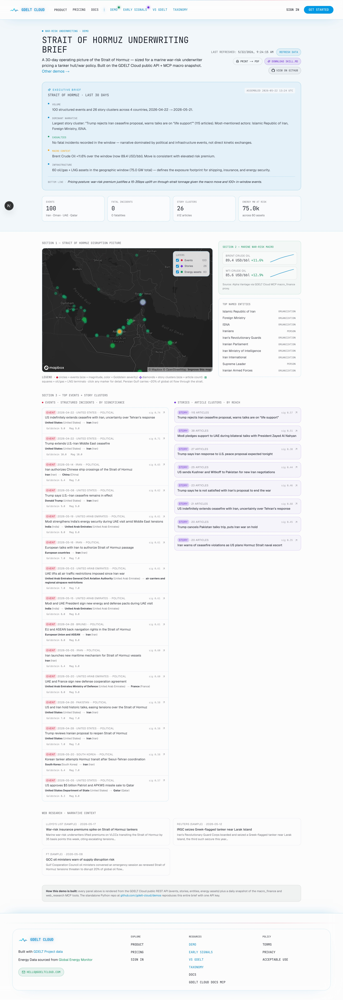

# ⚓ GDELT Cloud Demo — Strait of Hormuz Underwriting Brief

> A **printable war-risk underwriting view** of the Strait of Hormuz, built only on the GDELT Cloud public REST API. Sized for a marine war-risk underwriter pricing a tanker hull/war policy: 30-day operating picture, energy-asset exposure across the Persian Gulf, named entities and story clusters around Iran, with a Brent/WTI macro sidebar.

🌍 **Live version:** [gdeltcloud.com/demos/strait-of-hormuz-underwriting-brief](https://gdeltcloud.com/demos/strait-of-hormuz-underwriting-brief) · 📦 **Repo:** [github.com/gdelt-cloud/demos](https://github.com/gdelt-cloud/demos/tree/main/strait-of-hormuz-underwriting-brief)



---

## 📊 What it shows

- 📍 Structured **events** in Iran, Oman, UAE, Qatar (Strait of Hormuz littoral) over the last 30 days
- 🛢️ **Energy infrastructure** (oil/gas + LNG terminals) across the Persian Gulf bbox — `capacity_mw` rolled up as the **"Energy MW at risk"** headline figure
- 📰 **Story clusters** narrating the disruption picture (≥12 articles, filtered for high signal)
- 👥 **Named entities** linked to "Iran" search context
- 🗺️ An interactive **Leaflet map** with magnitude-sized + Goldstein-colored event markers + asset squares
- 📈 A **Brent / WTI macro sidebar** (in production: sourced from the GDELT Cloud MCP `macro_finance` proxy)
- 🖨️ **Print-CSS** for clean Cmd/Ctrl+P → PDF export
- ✨ **Executive brief** with a war-risk-underwriter takeaway (e.g. "premium uplift 15-35bps")

Pulls four endpoints:

```
GET /api/v2/events?country=IRN,OMN,ARE,QAT&...
GET /api/v2/stories?country=IRN,OMN,ARE,QAT&article_count_min=12&...
GET /api/v2/entities?search=Iran&...
GET /api/v2/energy/assets?bbox=24,49,30,57&tracker=oil_gas_plants,lng_terminals
```

---

## 🚀 Run it

### Prerequisites

- 🐍 Python 3.11+
- 📦 [`uv`](https://docs.astral.sh/uv/) installed
- 🔑 A GDELT Cloud API key — get one at [gdeltcloud.com/api-keys](https://gdeltcloud.com/api-keys)

### One-shot

```bash
git clone https://github.com/gdelt-cloud/demos.git
cd demos/strait-of-hormuz-underwriting-brief
cp .env.example .env
# edit .env, paste your gdelt_sk_* key into GDELT_API_KEY
uv sync
uv run python -m hormuz
```

Output:

```
GDELT Cloud · Strait of Hormuz Underwriting Brief · 2026-04-22 → 2026-05-21
Base URL: https://gdeltcloud.com
Fetched: 100 events · 26 stories · 20 entities · 60 energy assets (75.0 GW)

✓ Rendered: /path/to/demos/strait-of-hormuz-underwriting-brief/output/index.html
```

📂 Open `output/index.html` in your browser. 🖨️ Print to PDF works out of the box (Cmd/Ctrl+P) — the print CSS removes the map controls and tightens the layout.

### Custom window

```bash
HORMUZ_DATE_START=2026-03-22 HORMUZ_DATE_END=2026-04-20 uv run python -m hormuz
```

---

## 🤖 Hand it to your coding agent

> **There's a [`SKILL.md`](./SKILL.md) in this repo.** Hand it to your coding agent — Claude Code, Cursor, Copilot CLI — and ask it to scaffold a variant for your chokepoint, your peril, or your underwriting persona.

### 💬 Example prompts

```text
Use this SKILL.md to build an Eastern Mediterranean war-risk brief for
the cargo + hull renewal cycle.
```

```text
Build a Black Sea grain corridor underwriting brief — same shape, but
country net = UKR + TUR + BGR + ROU, anchored on Black Sea Fleet entities.
```

```text
Adapt this for an aviation war-risk underwriter — swap the energy bbox for
the airspace bbox + air-traffic-control entity anchor.
```

---

## 🛠️ Customize it

The demo is intentionally short — ~6 Python files — so you can swap region, peril, or persona.

| 🎯 To change | 📝 Edit |
|---|---|
| Country net | `src/hormuz/fetch.py` → `COUNTRIES` |
| Asset bbox | `src/hormuz/fetch.py` → `ASSETS_BBOX` |
| Entity search | `src/hormuz/fetch.py` → `client.entities(search=...)` |
| Story article threshold | `src/hormuz/fetch.py` → `article_count_min` |
| Date window default | `src/hormuz/settings.py` → `resolved_window()` |
| Map center + zoom | `templates/index.html.j2` → `L.map().setView(...)` |
| Macro sidebar values | `templates/index.html.j2` → Brent/WTI sparkline block |
| Branding / copy | `templates/index.html.j2` |

---

## 🧰 How it works

```
src/hormuz/
  client.py     # httpx wrapper for the GDELT Cloud REST API
  fetch.py      # the 4 API calls + dataclass (IRN/OMN/ARE/QAT, bbox 24,49,30,57)
  render.py     # Jinja2 -> single index.html with Leaflet map + total-MW rollup
  cli.py        # python -m hormuz entry point
  settings.py   # pydantic-settings for env vars
  __main__.py   # `python -m hormuz` dispatcher
templates/
  index.html.j2 # Tailwind via CDN + Leaflet via CDN + print CSS
```

The output is a **single self-contained HTML file**. No backend, no build step.

---

## 📄 License

MIT — fork freely.
